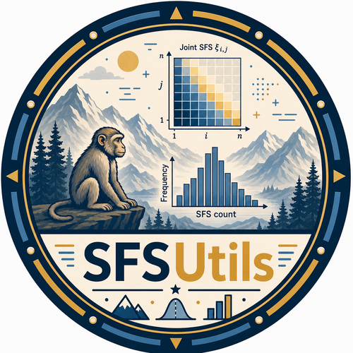

# SFSUtils  

``sfsutils`` is a package for parsing site frequency spectra (SFS), with support for versatile stratification, ancestral allele and site-degeneracy annotation, and filtering. Beyond the one-dimensional spectrum it also derives the joint SFS across several populations and the two-site SFS of linked pairs of sites, and reads from VCF files, VCF-Zarr stores, and tskit tree sequences (ARGs).

Please see the [documentation](https://sfsutils.readthedocs.io/en/latest/) for all the details.
